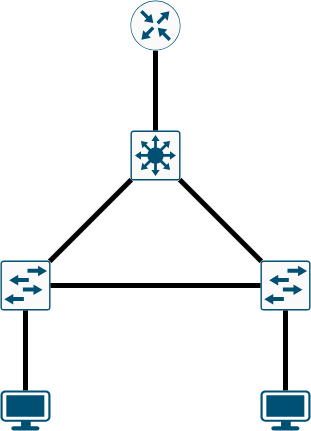

### Реализация небольшой сети офиса

В данной самостоятельной работе сделано:

1. Топология сверху вниз:



Устройства сверху вниз:
- Маршрутизатор
- Коммутатор (ядро сети)
- Коммутаторы доступа
- Клиенты сети
2. Каждый клиент находится в своем VLAN:
   * Client1 находится в VLAN 10 и сети 10.0.10.0/24 с ip 10.0.10.1
   * Client2 находится в VLAN 20 и сети 10.0.20.0/24 с ip 10.0.20.1
3. В сети настроен протокол STP:
   * Коммутатор уровня распределения является корнем сети для обоих VLAN
   * Линк между коммутаторами уровня доступ должен стать заблокированным (при отсутсвии неполадок сети)
4. Клиенты могут отправить друг другу PING
5. Работа выполнена в [EVE-NG](https://www.eve-ng.net/)

---

### Решение

Конфигурации устройств находятся в папке [configs](solution/configs), лаба: [lab](solution/Ninevskiy.zip)
Вывод устройств:

VPC5:
```
VPCS : 10.0.10.1 255.255.255.0 gateway 10.0.10.2
VPCS> ping 10.0.20.1 -c 1
84 bytes from 10.0.20.1 icmp_seq=1 ttl=63 time=52.197 ms
```

VPC6:
```
VPCS : 10.0.20.1 255.255.255.0 gateway 10.0.20.2
VPCS> ping 10.0.10.1 -c 1
84 bytes from 10.0.10.1 icmp_seq=1 ttl=63 time=15.002 ms
```
